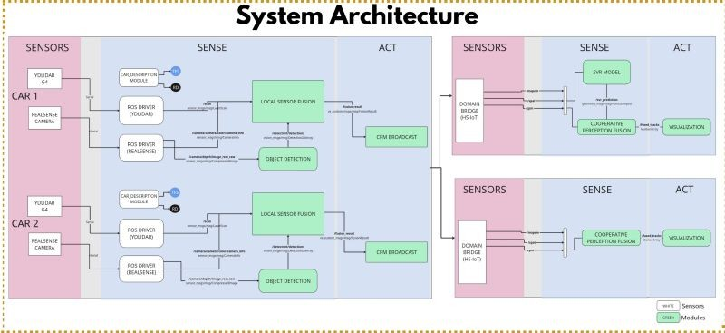

# Cooperative Perception-Based Position Fusion using Dynamic Covariance Estimation

**Author:** [VIYYAPU V S D SAI VAMSI](https://git.hs-coburg.de/Vamsi742003)

---

# Table of Contents

- [Overview](#overview)
- [System Architecture](#system-architecture)
- [Project Workflow](#project-workflow)
- [ROS2 Topics](#ros2-topics)
- [Component Functionalities](#component-functionalities)
- [Data Fusion Pipeline](#data-fusion-pipeline)
- [Installation & Setup](#installation--setup)
- [Testing](#testing)
- [Results](#results)
- [Future Improvements](#future-improvements)
- [Conclusion](#conclusion)

---

# Overview

Autonomous vehicles rely primarily on onboard sensors such as LiDAR and cameras to perceive their surroundings. However, these sensors are limited by their field of view and can fail to detect objects hidden by obstacles or outside the sensing range.

This project implements a **Cooperative Perception-Based Position Fusion** framework in **ROS2** that combines local object detections with information received from neighbouring connected vehicles through **Cooperative Perception Messages (CPMs)**.

To improve localisation accuracy, the project employs a **Support Vector Regression (SVR)** model to dynamically estimate the measurement covariance used by an **Extended Kalman Filter (EKF)**. Instead of using a fixed measurement covariance, the EKF adapts to the uncertainty of every incoming detection, producing a more accurate estimate of object position.

The final fused object positions are visualized in **RViz2** for real-time analysis.

---

# System Architecture


The system consists of the following modules:

- Local Perception
- Cooperative Perception Message (CPM) Receiver
- Coordinate Transformation
- Dynamic Covariance Estimation (SVR)
- Extended Kalman Filter
- Position Fusion
- RViz Visualization

---

# Project Workflow

```
Local Sensor Detection
          │
          ▼
 Object Position Extraction
          │
          ▼
 Receive CPM Messages
          │
          ▼
 Coordinate Transformation
          │
          ▼
 Dynamic Covariance Prediction (SVR)
          │
          ▼
 Extended Kalman Filter
          │
          ▼
 Position Fusion
          │
          ▼
 RViz Visualization
```

---

# ROS2 Topics

| Topic Name | Message Type | Direction | Description |
|------------|--------------|-----------|-------------|
| `/fused_objects` | Custom Message | **Input** | Local object detections generated by the perception module |
| `/tf` | `tf2_msgs/TFMessage` | **Input** | Coordinate frame transformations |
| `/odom` | `nav_msgs/Odometry` | **Input** | Ego vehicle position |
| `/visualization_marker_array` | `visualization_msgs/MarkerArray` | **Output** | RViz visualization of fused object positions |

> **Note:** Replace **Custom Message** with the actual message type used in your implementation.

---

# Component Functionalities

## 1. Local Perception

The system receives locally detected objects generated by the onboard perception system.

Each detected object contains:

- Object position
- Detection confidence
- Object dimensions
- Timestamp

These detections represent the local observations of the environment.

---

## 2. Cooperative Perception Messages (CPM)

Neighbouring connected vehicles broadcast object information using CPM messages.

Each received message contains information such as:

- Object position
- Object dimensions
- Detection confidence
- Timestamp

This enables the ego vehicle to perceive objects beyond the range or line-of-sight of its own sensors.

---

## 3. Coordinate Transformation

Since neighbouring vehicles observe objects from different coordinate systems, every received detection must be transformed into the ego vehicle's coordinate frame.

The transformation is performed using **TF2**.

Example:

```python
transform = self.tf_buffer.lookup_transform(
    target_frame,
    source_frame,
    Time()
)
```

After transformation, all object positions are represented in the same coordinate frame, enabling accurate fusion.

---

## 4. Dynamic Covariance Estimation

Traditional Kalman Filters use a constant measurement covariance matrix.

However, measurement uncertainty changes depending on:

- Detection confidence
- Object distance
- Sensor viewpoint
- Object dimensions

Instead of using a manually tuned covariance matrix, this project estimates the measurement covariance dynamically using a trained **Support Vector Regression (SVR)** model.

### SVR Input Features

The SVR model receives:

- Detection confidence
- X position
- Y position
- Z position
- Object width
- Object height
- Object depth

The model predicts the measurement uncertainty associated with every object detection.

This adaptive covariance improves the reliability of the EKF update step.

---

## 5. Extended Kalman Filter (EKF)

The Extended Kalman Filter estimates the position of detected objects by combining local observations with cooperative perception measurements.

The EKF performs two operations.

### Prediction

The prediction step estimates the object's next position using the previous state estimate.

### Update

The update step incorporates the latest measurement and corrects the predicted position using the measurement covariance estimated by the SVR model.

Unlike conventional EKF implementations that use a fixed covariance matrix, this project dynamically estimates the covariance for every incoming measurement, allowing the filter to adapt to changing sensor uncertainties and improving localisation accuracy.

---

## 6. Data Association

Before fusion, local and cooperative detections are associated to determine whether they correspond to the same physical object.

The association considers:

- Spatial proximity
- Detection confidence
- Timestamp consistency

Only matching detections are fused together.

---

## 7. Position Fusion

Once corresponding detections are associated, the Extended Kalman Filter combines their position measurements.

The dynamically estimated covariance allows the filter to assign higher weight to more reliable measurements while reducing the influence of uncertain observations.

The output is a refined estimate of the object's position.

---

## 8. Visualization

The fused object positions are published as **MarkerArray** messages.

RViz visualizes:

- Object positions
- Object IDs
- Position markers
- Cooperative perception results

This enables real-time inspection of the fusion process.

---

# Data Fusion Pipeline

```
Local Detection
        │
        ▼
 Cooperative Perception Messages
        │
        ▼
 Coordinate Transformation
        │
        ▼
 Dynamic Covariance Prediction
        │
        ▼
 Extended Kalman Filter
        │
        ▼
 Position Fusion
        │
        ▼
 RViz Visualization
```

---

# Installation & Setup

Clone the repository

```bash
git clone <repository-url>
```

Move to your ROS2 workspace

```bash
cd ~/ros2_ws
```

Build the package

```bash
colcon build --packages-select <package_name>
```

Source the workspace

```bash
source install/setup.bash
```

Run the fusion node

```bash
ros2 run <package_name> <executable_name>
```

Launch RViz2

```bash
rviz2
```

---

# Testing

Verify that the required topics are available

```bash
ros2 topic list
```

Monitor incoming object detections

```bash
ros2 topic echo /fused_objects
```

Monitor fused visualization markers

```bash
ros2 topic echo /visualization_marker_array
```

Inspect the TF tree

```bash
ros2 run tf2_tools view_frames
```

Visualize the results

```bash
rviz2
```

---

# Results

The cooperative perception framework successfully:

- Combines local and cooperative object detections.
- Predicts measurement uncertainty using Support Vector Regression.
- Estimates accurate object positions using an Extended Kalman Filter.
- Improves localisation accuracy by dynamically adapting the measurement covariance.
- Produces stable and consistent object position estimates.
- Visualizes fused object positions in RViz2.
- 
Compared to an EKF using a fixed covariance matrix, the dynamic covariance estimation provides more reliable position estimates under varying sensor conditions.

---

# Future Improvements

Possible future extensions include:

- 3D LiDAR integration
- Multi-camera cooperative perception
- Graph Neural Network-based data association
- Transformer-based cooperative perception
- Vehicle-to-Infrastructure (V2I) perception
- Deep learning-based uncertainty estimation
- Multi-agent cooperative perception
- Real-time optimisation for embedded hardware

---

# Conclusion

This project presents a **Cooperative Perception-Based Position Fusion** framework for connected autonomous vehicles.

By combining locally detected objects with information received from neighbouring vehicles, the system extends environmental awareness beyond the limitations of onboard sensors.

A key contribution of this work is the use of **Support Vector Regression (SVR)** to dynamically estimate the measurement covariance used by the **Extended Kalman Filter (EKF)**. This adaptive approach enables the filter to account for changing sensor uncertainties and improves the accuracy of object position estimation.

The fused positions are visualized in **RViz2**, providing a clear representation of the cooperative perception process and demonstrating the effectiveness of dynamic covariance estimation for connected autonomous driving systems.
